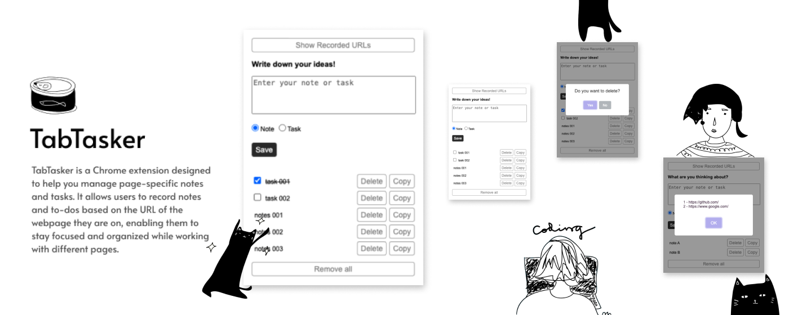

# TabTasker | 頁籤追蹤 

## Description

TabTasker | 頁籤追蹤 is a Chrome extension designed to boost productivity by allowing users to manage notes and tasks based on the URL of each webpage. Whether you're juggling multiple projects or browsing through numerous tabs, TabTasker helps you stay organized and focused, ensuring that important tasks don’t fall through the cracks.

By linking notes and to-dos to specific URLs, users can easily record thoughts and tasks related to each page and quickly retrieve them the next time they visit. It's a simple and intuitive solution for keeping your workflow efficient and your workspaces organized.

TabTasker is perfect for users who need to handle multiple pages at once or those who want an easy way to track notes and tasks directly from their browser.

## Features

- **Page-Specific Notes**: Add and manage notes that are linked to the URL of the current webpage.
- **Task Management**: Keep track of tasks and to-dos specific to each webpage.
- **To-Dos and Notes**: Easily add to-dos or notes as needed, and use drag-and-drop to reorder them.
- **Enhanced Focus**: Helps users concentrate on their work by providing contextual information and reminders related to the current page.
- **Track URLs**: Use the "Show Recorded URLs" button to list all URLs with notes and to-dos.

## Installation

1. Go to the [Chrome Web Store](https://chrome.google.com/webstore).
2. Search for "TabTasker" and click on "Add to Chrome".
3. You can also directly access the extension's page and install it by clicking the following link: [TabTasker](https://chromewebstore.google.com/detail/tabtasker-%E9%A0%81%E7%B1%A4%E8%BF%BD%E8%B9%A4/dcabnoagnoehmdohofnlbbpfhmclddbo).
3. Finally, follow the prompts to complete the installation.

## References

- [Chrome Extensions Documentation](https://developer.chrome.com/docs/extensions/)
- [Chrome Web Store Developer Documentation](https://developer.chrome.com/docs/webstore/)

## Note

The idea for TabTasker came to me while I was researching at work. I used to write down all important points or interesting things in a single notebook, but when I got interrupted or distracted, I would forget which website the key information came from. Additionally, having too many open tabs made it hard to tell which ones actually needed to be kept or had pending tasks. That’s when the idea of creating TabTasker emerged.

I hope it can help those who face similar issues.

---

# TabTasker | 頁籤追蹤 

## 描述  

TabTasker | 頁籤追蹤 是一款專為提高工作效率設計的 Chrome 擴充功能，讓使用者能夠根據每個網頁的 URL 來管理筆記和待辦事項。無論你在同時處理多個專案，還是瀏覽大量的網頁，TabTasker 都可以幫助你保持專注，避免遺漏重要的任務。

透過將筆記和待辦事項與網頁 URL 綁定，使用者可以輕鬆記錄每個頁面相關的想法和工作，並在下次回到該網頁時，快速取回之前的內容。它是一個簡單、直觀的解決方案，讓你的工作流程更加高效和井然有序。

TabTasker 不僅適合需要同時處理多個頁面的使用者，也適合那些需要在瀏覽器中隨時記錄筆記和管理任務的人。

## 功能特點

- **特定頁面的筆記**：新增和管理與當前網頁 URL 相關聯的筆記。
- **任務管理**：可追蹤每個網頁的特定任務和待辦事項。
- **待辦事項和筆記**：輕鬆新增待辦事項或筆記，並使用拖放功能來重新排列它們。
- **增強專注力**：通過提供與當前頁面相關的上下文資訊和提醒，幫助使用者專注於工作。
- **追蹤 URL**：使用「顯示已記錄的 URL」按鈕列出所有包含筆記和待辦事項的 URL。

## 安裝步驟

1. 前往 [Chrome 線上應用程式商店](https://chrome.google.com/webstore)。
2. 搜尋「TabTasker」並點擊「添加至 Chrome」。
3. 也可以直接點擊以下連結，直接進入套件頁面進行安裝：[TabTasker | 頁籤追蹤](https://chromewebstore.google.com/detail/tabtasker-%E9%A0%81%E7%B1%A4%E8%BF%BD%E8%B9%A4/dcabnoagnoehmdohofnlbbpfhmclddbo)。
4. 最後按照提示完成安裝。

## 參考資料

- [Chrome 擴充功能文檔](https://developer.chrome.com/docs/extensions/)
- [Chrome 線上應用程式商店開發者文檔](https://developer.chrome.com/docs/webstore/)

## 小記

TabTasker 想法來自於我工作時在查找資料的時候，以往我習慣性地會將重點或是有興趣的都寫在同一個記事本中，但當我被打斷或是分神時，就發現我忘記這個重點是哪個網站看的，另外，有時候分頁過多，就會使人不確定哪一個是才是真正有需要保留的或是正在待辦的頁籤，因此有產生了想要製作 TabTasker 的想法。

希望有幫助到跟我有同樣困擾的大家。
