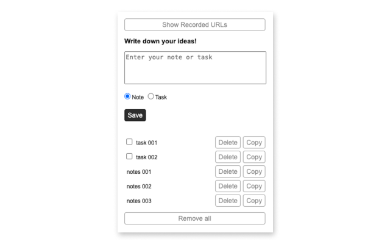
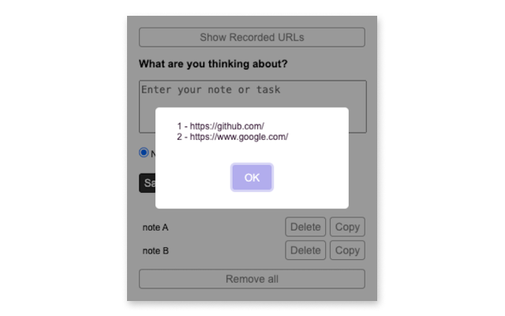

# TabTasker | 頁籤追蹤 

**Description**: 
TabTasker is a Chrome extension designed to help you manage page-specific notes and tasks. It allows users to record notes and to-dos based on the URL of the webpage they are on, enabling them to stay focused and organized while working with different pages.

## Features

- **Page-Specific Notes**: Add and manage notes that are linked to the URL of the current webpage.
- **Task Management**: Keep track of tasks and to-dos specific to each webpage.
- **Enhanced Focus**: Helps users concentrate on their work by providing contextual information and reminders related to the current page.
- **To-Dos and Notes**: Easily add to-dos or notes as needed, and use drag-and-drop to reorder them.
- **Track URLs**: Use the "Show Recorded URLs" button to list all URLs with notes and to-dos.

## Installation

1. Go to the [Chrome Web Store](https://chrome.google.com/webstore).
2. Search for "TabTasker" and click on "Add to Chrome".
3. Follow the prompts to complete the installation.

## References

- [Chrome Extensions Documentation](https://developer.chrome.com/docs/extensions/)
- [Chrome Web Store Developer Documentation](https://developer.chrome.com/docs/webstore/)

