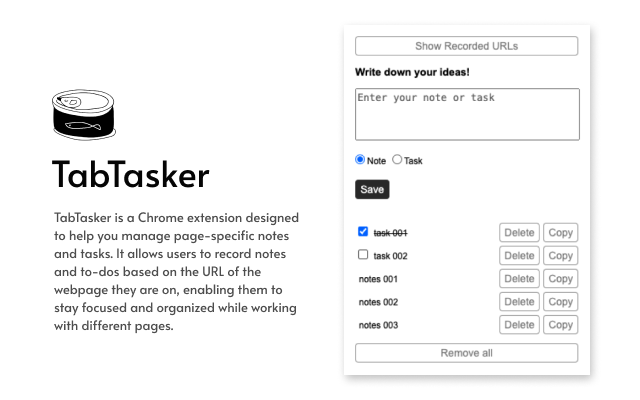

# TabTasker | 頁籤追蹤 

## Description

TabTasker is a Chrome extension designed to help you manage page-specific notes and tasks. It allows users to record notes and to-dos based on the URL of the webpage they are on, enabling them to stay focused and organized while working with different pages.

## Features

- **Page-Specific Notes**: Add and manage notes that are linked to the URL of the current webpage.
- **Task Management**: Keep track of tasks and to-dos specific to each webpage.
- **To-Dos and Notes**: Easily add to-dos or notes as needed, and use drag-and-drop to reorder them.
- **Enhanced Focus**: Helps users concentrate on their work by providing contextual information and reminders related to the current page.
- **Track URLs**: Use the "Show Recorded URLs" button to list all URLs with notes and to-dos.

## Installation

1. Go to the [Chrome Web Store](https://chrome.google.com/webstore).
2. Search for "TabTasker" and click on "Add to Chrome".
3. Follow the prompts to complete the installation.

## References

- [Chrome Extensions Documentation](https://developer.chrome.com/docs/extensions/)
- [Chrome Web Store Developer Documentation](https://developer.chrome.com/docs/webstore/)

## Note

The idea for TabTasker came to me while I was researching at work. I used to write down all important points or interesting things in a single notebook, but when I got interrupted or distracted, I would forget which website the key information came from. Additionally, having too many open tabs made it hard to tell which ones actually needed to be kept or had pending tasks. That’s when the idea of creating TabTasker emerged.

I hope it can help those who face similar issues.

---

# TabTasker | 頁籤追蹤 

## 描述  

TabTasker 是一款 Chrome 擴充功能，主要是幫助使用者依據網頁 URL 來管理相關的筆記和任務，因此可提高使用者在處理不同頁面時的專注力。

## 功能特點

- **特定頁面的筆記**：新增和管理與當前網頁 URL 相關聯的筆記。
- **任務管理**：可追蹤每個網頁的特定任務和待辦事項。
- **待辦事項和筆記**：輕鬆新增待辦事項或筆記，並使用拖放功能來重新排列它們。
- **增強專注力**：通過提供與當前頁面相關的上下文資訊和提醒，幫助使用者專注於工作。
- **追蹤 URL**：使用「顯示已記錄的 URL」按鈕列出所有包含筆記和待辦事項的 URL。

## 安裝步驟

1. 前往 [Chrome 線上應用程式商店](https://chrome.google.com/webstore)。
2. 搜尋「TabTasker」並點擊「添加至 Chrome」。
3. 按照提示完成安裝。

## 參考資料

- [Chrome 擴充功能文檔](https://developer.chrome.com/docs/extensions/)
- [Chrome 線上應用程式商店開發者文檔](https://developer.chrome.com/docs/webstore/)

## 小記

TabTasker 想法來自於我工作時在查找資料的時候，以往我習慣性地會將重點或是有興趣的都寫在同一個記事本中，但當我被打斷或是分神時，就發現我忘記這個重點是哪個網站看的，另外，有時候分頁過多，就會使人不確定哪一個是才是真正有需要保留的或是正在待辦的頁籤，因此有產生了想要製作 TabTasker 的想法。

希望有幫助到跟我有同樣困擾的大家。
